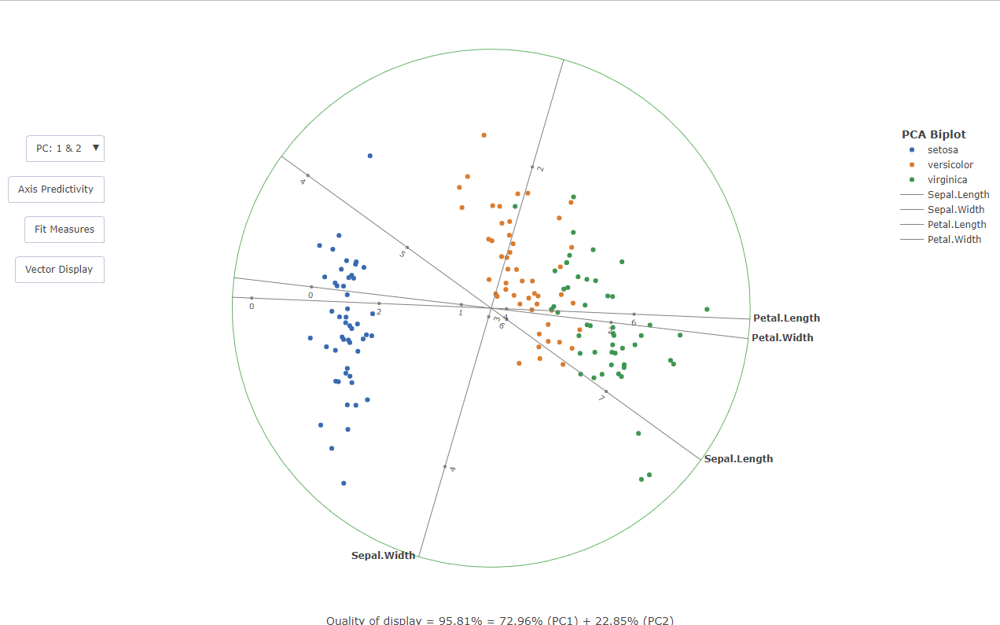
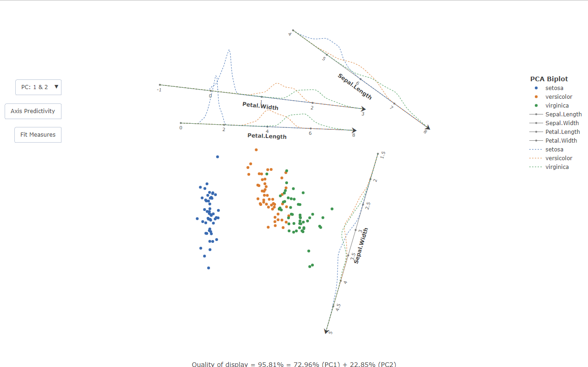

<!-- README.md is generated from README.Rmd. Please edit that file -->

```{r, include = FALSE}
knitr::opts_chunk$set(
  collapse = TRUE,
  comment = "#>",
  fig.path = "man/figures/README-",
  out.width = "100%"
)
```

# bipl5

<!-- badges: start -->
<!-- badges: end -->

The goal of bipl5 is to provide a modern take on PCA biplots with calibrated axes. The biplots are rendered in HTML via the plotly graphing library, upon which custom JavaScript code is appended to make the plot reactive. The traditional biplot view is also extended through an algorithm that translates the axes out of the data centroid, decluttering the view. In addition to the former, inter-class kernel densities are superimposed on the axes to give an indication of the data spread across the variables.

## Installation

You can install the latest version of bipl5 from CRAN with:

```{r}
install.packages("bipl5")
library(bipl5)
```

## Example: Traditional PCA biplot

This is a basic example of constructing a traditional PCA biplot with calibrated axes and vector loadings. In the literature, a square is often drawn around the biplot purely for aesthetic reasons. This approached was modified by constructing a circle which bounds the plot:

```{r example}
PCAbiplot(iris[,-5],group=iris[,5])
```




On the rendered HTML file there are reactive events embedded on the plot, such as changing the principal components used for the scaffolding. More detailed information can be obtained by reading the help documentation

```{r cars}
?PCAbiplot
```


## Example: Automated Orthogonal Parallel Translation of the axes

The cluttering in the centroid of the biplot can be relieved by the Orthogonal Parallel Translation of the axes out of the data centroid in such a way that the correlation structure among variables is retained. This is done with the following:

```{r}
x<-PCAbiplot(iris[,-5],group=iris[,5])
x |> TDAbiplot()
```



