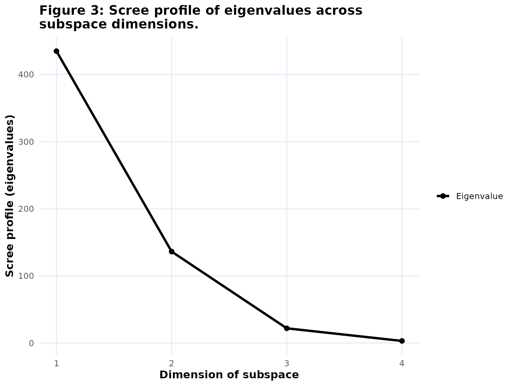

# PCA Biplots

``` r
suppressPackageStartupMessages(library(bipl5))
```

This vignette focuses on the modern `bipl5` workflow for principal
component analysis (PCA) biplots:

``` r
init_biplot(...) |> scale_mds(type = "pca", ...)
```

The mathematical background is the same background documented in
[`wrap_bipl5.PCA()`](https://www.bipl5.co.za/reference/wrap_bipl5.PCA.md),
but the examples below use the newer specification-based workflow
because it is the most natural entry point for package users who want to
build a single display first and then extend it later.

The goals of this vignette are to:

- construct a PCA biplot with
  [`init_biplot()`](https://www.bipl5.co.za/reference/init_biplot.md)
  and [`scale_mds()`](https://www.bipl5.co.za/reference/scale_mds.md)
- show the printed structure of the resulting `bipl5_biplot`
- add extra `mdsDisplays` with
  [`append_mdsDisplay()`](https://www.bipl5.co.za/reference/append_mdsDisplay.md)
- demonstrate
  [`format_samples()`](https://www.bipl5.co.za/reference/format_samples.md)
  with both one and two categorical stratifications
- explain the PCA fit measures stored in `fit_measures`
- preserve the current long-form documentation of the PCA biplot
  mathematics

## Building a PCA biplot

[`init_biplot()`](https://www.bipl5.co.za/reference/init_biplot.md)
stores the data and preprocessing choices, while
[`scale_mds()`](https://www.bipl5.co.za/reference/scale_mds.md) fits and
compiles the requested biplot. If the input data frame contains
categorical columns, those columns are retained inside the specification
object so they can be used later by
[`format_samples()`](https://www.bipl5.co.za/reference/format_samples.md).

``` r
iris2 <- iris
iris2$Band <- factor(
  rep(c("class1", "class2", "class3", "class4"), length.out = nrow(iris2))
)

pca_spec <- init_biplot(iris2, scale = TRUE)

bp_pca <- pca_spec |>
  scale_mds(
    type = "pca",
    eigenvectors = c(1, 2),
    group_aes = iris2$Species,
    show_group_means = TRUE
  )
```

Immediately after
[`scale_mds()`](https://www.bipl5.co.za/reference/scale_mds.md), the
object contains one compiled display and a PCA fit-measures branch:

``` r
bp_pca
#> bipl5_biplot [PCA] 
#> ├── mdsDisplay_12 [PC 1 & 2] <bipl5_mdsDisplay>
#> │   ├── Data <bipl5_data>
#> │   │   ├── sample_coordinates  [150 x 2]
#> │   │   ├── axes_coordinates  [4 axes]
#> │   │   └── translated_axes_coordinates
#> │   ├── trace_data  [35 traces]
#> │   └── annotations  [140 items]
#> └── fit_measures <bipl5_fitmeasures>
#>     ├── CumPred  [5 traces]
#>     ├── CumAd  [4 traces]
#>     ├── VarExp  [5 traces]
#>     ├── Scree  [1 traces]
#>     └── fit_table_12  [PC 1 & 2]
```

The default PCA plot is interactive. The left-hand side is the biplot
itself, while the right-hand side fit panel can be opened from the
widget controls.

``` r
plot(bp_pca)
```

## Adding more mdsDisplays

The [`scale_mds()`](https://www.bipl5.co.za/reference/scale_mds.md)
workflow deliberately compiles only the requested pair of principal
components. This keeps the initial object light, and it mirrors the fact
that a user often wants to start with just one view. Additional views
can then be added with
[`append_mdsDisplay()`](https://www.bipl5.co.za/reference/append_mdsDisplay.md).

Here we extend the original `PC 1 & 2` display to also include
`PC 1 & 3` and `PC 2 & 3`:

``` r
bp_pca_full <- bp_pca |>
  append_mdsDisplay(c(1, 3)) |>
  append_mdsDisplay(c(2, 3))
```

The printed tree now reflects three stored displays and one fit table
for each pair:

``` r
bp_pca_full
#> bipl5_biplot [PCA] 
#> ├── mdsDisplay_12 [PC 1 & 2] <bipl5_mdsDisplay>
#> │   ├── Data <bipl5_data>
#> │   │   ├── sample_coordinates  [150 x 2]
#> │   │   ├── axes_coordinates  [4 axes]
#> │   │   └── translated_axes_coordinates
#> │   ├── trace_data  [35 traces]
#> │   └── annotations  [140 items]
#> ├── mdsDisplay_13 [PC 1 & 3] <bipl5_mdsDisplay>
#> │   ├── Data <bipl5_data>
#> │   │   ├── sample_coordinates  [150 x 2]
#> │   │   ├── axes_coordinates  [4 axes]
#> │   │   └── translated_axes_coordinates
#> │   ├── trace_data  [35 traces]
#> │   └── annotations  [150 items]
#> ├── mdsDisplay_23 [PC 2 & 3] <bipl5_mdsDisplay>
#> │   ├── Data <bipl5_data>
#> │   │   ├── sample_coordinates  [150 x 2]
#> │   │   ├── axes_coordinates  [4 axes]
#> │   │   └── translated_axes_coordinates
#> │   ├── trace_data  [35 traces]
#> │   └── annotations  [160 items]
#> └── fit_measures <bipl5_fitmeasures>
#>     ├── CumPred  [5 traces]
#>     ├── CumAd  [4 traces]
#>     ├── VarExp  [5 traces]
#>     ├── Scree  [1 traces]
#>     ├── fit_table_12  [PC 1 & 2]
#>     ├── fit_table_13  [PC 1 & 3]
#>     └── fit_table_23  [PC 2 & 3]
```

The plot now exposes a dropdown for switching between the stored PC
pairs.

``` r
plot(bp_pca_full)
```

## Formatting samples

[`format_samples()`](https://www.bipl5.co.za/reference/format_samples.md)
does not refit the PCA model. It rebuilds the sample-trace block inside
each stored `mdsDisplay`, so it is the right tool when the ordination is
fixed but the display grouping needs to change.

We begin with a colour stratification by species:

``` r
bp_pca_species <- bp_pca_full |>
  format_samples(
    stratify = "col",
    by = Species,
    col = c("tomato", "steelblue", "darkgreen")
  )
```

We then add a second categorical stratification through plotting
symbols. Since `Band` is different from `Species`, the plotted
observation traces are rebuilt internally as the observed
`Species x Band` combinations, while the legend is kept readable by
showing separate legend sections for the colour and symbol variables.

``` r
bp_pca_dual <- bp_pca_species |>
  format_samples(
    stratify = "symbol",
    by = Band,
    pch = c(15, 16, 17, 18)
  )
```

The formatted object remains a `bipl5_biplot`, so it can still be
printed, subset, extended, and plotted as usual.

``` r
plot(bp_pca_dual)
```

## PCA fit measures

PCA biplots are the richest objects in the current package because they
carry a full `fit_measures` branch. The print method makes the available
fit objects explicit:

``` r
bp_pca_full$fit_measures
#> bipl5_fitmeasures 
#> ├── CumPred  [5 traces]
#> ├── CumAd  [4 traces]
#> ├── VarExp  [5 traces]
#> ├── Scree  [1 traces]
#> ├── fit_table_12  [PC 1 & 2]
#> ├── fit_table_13  [PC 1 & 3]
#> └── fit_table_23  [PC 2 & 3]
```

In the interactive PCA widget, these are exposed through the “Measures
of Fit” button and the fit-panel dropdown. The fit objects are:

- `CumPred`: cumulative predictivity across increasing subspace
  dimension. Each line tracks one variable’s cumulative axis
  predictivity, and the weighted mean line equals the overall display
  quality.
- `CumAd`: cumulative adequacy across increasing subspace dimension.
  This shows how well each variable direction is represented by the
  accumulated loading structure, irrespective of the final
  two-dimensional display pair.
- `VarExp`: variance explained. In the current implementation this
  combines a line for the individual proportion of variance explained by
  each principal component with stacked variable-level contributions.
- `Scree`: the eigenvalue profile across the principal components.
- `fit_table_ij`: the pair-specific summary table for the active
  display. Each table reports variable-level adequacy and predictivity
  for that specific `PC i & j` map.

If you want one of the graph-based fit objects on its own, you can
extract it and plot it directly:

``` r
fit_scree <- extract(bp_pca_full, fit_measures, Scree)
plot(fit_scree)
```



The summary table is not a separate `bipl5_fit` graph object, because it
is already stored in the `fit_measures` branch as a plotly table trace.
It updates when the active `mdsDisplay` changes.

## Mathematical background

This section preserves the current long-form PCA documentation in
narrative form.

Let $\mathbf{X} \in {\mathbb{R}}^{n \times p}$ denote the processed data
matrix stored in the input object after centring and any optional
scaling. PCA is performed on that processed matrix, so the singular
value decomposition is

$$\mathbf{X} = \mathbf{U}\mathbf{D}\mathbf{V}^{\top},$$

where $\mathbf{U}^{\top}\mathbf{U} = \mathbf{I}$,
$\mathbf{V}^{\top}\mathbf{V} = \mathbf{I}$, and
$\mathbf{D} = \operatorname{diag}\left( d_{1},\ldots,d_{q} \right)$ with
$q = \operatorname{rank}(\mathbf{X})$ and
$d_{1} \geq \cdots \geq d_{q} \geq 0$. The principal component score
vectors are

$$\mathbf{z}_{t} = d_{t}\mathbf{u}_{t} = \mathbf{X}\mathbf{v}_{t},\qquad t = 1,\ldots,q.$$

Suppose the displayed pair is $(a,b)$ with $a < b$. Let
$\mathbf{J}_{ab}$ be the diagonal selector matrix with ones in positions
$a$ and $b$. Then the two-dimensional fitted matrix is

$${\widehat{\mathbf{X}}}_{ab} = \mathbf{U}\mathbf{D}\mathbf{J}_{ab}\mathbf{V}^{\top} = \mathbf{X}\mathbf{V}\mathbf{J}_{ab}\mathbf{V}^{\top}.$$

Equivalently, with $\mathbf{U}_{ab}$, $\mathbf{D}_{ab}$, and
$\mathbf{V}_{ab}$ containing only the selected components,

$${\widehat{\mathbf{X}}}_{ab} = \mathbf{U}_{ab}\mathbf{D}_{ab}\mathbf{V}_{ab}^{\top} = d_{a}\mathbf{u}_{a}\mathbf{v}_{a}^{\top} + d_{b}\mathbf{u}_{b}\mathbf{v}_{b}^{\top}.$$

For the ordinary PCA biplot the displayed sample coordinates are

$$\mathbf{Z}_{ab} = \mathbf{U}_{ab}\mathbf{D}_{ab},\qquad\mathbf{H}_{ab} = \mathbf{V}_{ab},$$

so that

$${\widehat{\mathbf{X}}}_{ab} = \mathbf{Z}_{ab}\mathbf{H}_{ab}^{\top}.$$

If $\mathbf{h}_{(j)}$ is the displayed direction for variable $j$, then
the fitted value for observation $i$ on variable $j$ is

$${\widehat{x}}_{ij} = \mathbf{z}_{i}^{\top}\mathbf{h}_{(j)},$$

and the calibrated axis point corresponding to marker value $\mu$ is

$$\mathbf{p}_{\mu j} = \frac{\mu}{\mathbf{h}_{(j)}^{\top}\mathbf{h}_{(j)}}\mathbf{h}_{(j)}.$$

For a correlation biplot the factorization can instead be written as

$${\widehat{\mathbf{X}}}_{ab} = \mathbf{U}_{ab}\left( \mathbf{V}_{ab}\mathbf{D}_{ab} \right)^{\top},$$

so the displayed sample coordinates are $\mathbf{U}_{ab}$ and the
displayed variable directions are the rows of
$\mathbf{V}_{ab}\mathbf{D}_{ab}$. In that setting the variable
directions are tuned to variable-correlation structure rather than raw
score geometry.

Two orthogonality relations are central:

$$\mathbf{X}\mathbf{X}^{\top} = {\widehat{\mathbf{X}}}_{ab}{\widehat{\mathbf{X}}}_{ab}^{\top} + \mathbf{E}_{ab}\mathbf{E}_{ab}^{\top},$$

and

$$\mathbf{X}^{\top}\mathbf{X} = {\widehat{\mathbf{X}}}_{ab}^{\top}{\widehat{\mathbf{X}}}_{ab} + \mathbf{E}_{ab}^{\top}\mathbf{E}_{ab},$$

where $\mathbf{E}_{ab} = \mathbf{X} - {\widehat{\mathbf{X}}}_{ab}$. The
first justifies sample-side fit measures (Type A orthogonality), and the
second justifies variable-side fit measures (Type B orthogonality).

For sample $i$, the sample predictivity is

$$\psi_{i} = \frac{\parallel {\widehat{\mathbf{x}}}_{i \cdot} \parallel^{2}}{\parallel \mathbf{x}_{i \cdot} \parallel^{2}} = 1 - \frac{\parallel \mathbf{x}_{i \cdot} - {\widehat{\mathbf{x}}}_{i \cdot} \parallel^{2}}{\parallel \mathbf{x}_{i \cdot} \parallel^{2}}.$$

For variable $j$, the axis predictivity is

$$\phi_{j} = \frac{\parallel {\widehat{\mathbf{x}}}_{(j)} \parallel^{2}}{\parallel \mathbf{x}_{(j)} \parallel^{2}} = 1 - \frac{\parallel \mathbf{x}_{(j)} - {\widehat{\mathbf{x}}}_{(j)} \parallel^{2}}{\parallel \mathbf{x}_{(j)} \parallel^{2}}.$$

The overall quality of the displayed PCA plane is

$$R_{{disp},ab}^{2} = \frac{\parallel {\widehat{\mathbf{X}}}_{ab} \parallel_{F}^{2}}{\parallel \mathbf{X} \parallel_{F}^{2}} = \frac{d_{a}^{2} + d_{b}^{2}}{\sum\limits_{t = 1}^{q}d_{t}^{2}}.$$

Because of orthogonality, this same quantity can be read as a weighted
average of either the sample predictivities or the axis predictivities.
On the variable side,

$$R_{{disp},ab}^{2} = \sum\limits_{j = 1}^{p}w_{j}\phi_{j},\qquad w_{j} = \frac{\parallel \mathbf{x}_{(j)} \parallel^{2}}{\parallel \mathbf{X} \parallel_{F}^{2}}.$$

When the processed variables all have equal sums of squares, the overall
quality is simply the average axis predictivity. This is one reason
standardized PCA is often easy to interpret.

PCA also gives a clean per-component decomposition. Since

$${\widehat{\mathbf{X}}}_{ab} = d_{a}\mathbf{u}_{a}\mathbf{v}_{a}^{\top} + d_{b}\mathbf{u}_{b}\mathbf{v}_{b}^{\top},$$

the two displayed rank-1 pieces are orthogonal, and therefore

$$R_{{disp},ab}^{2} = R_{a}^{2} + R_{b}^{2},\qquad R_{a}^{2} = \frac{d_{a}^{2}}{\parallel \mathbf{X} \parallel_{F}^{2}},\qquad R_{b}^{2} = \frac{d_{b}^{2}}{\parallel \mathbf{X} \parallel_{F}^{2}}.$$

Likewise,

$$\phi_{j} = \phi_{ja} + \phi_{jb},\qquad\psi_{i} = \psi_{ia} + \psi_{ib},$$

so both axis-side and sample-side quality can be broken down into the
two displayed components.

The package documentation also distinguishes these sum-of-squares
measures from the direct-reading diagnostics of Alves (2012). If
$\mathbf{g}_{(j)}$ is the displayed direction of variable $j$, then the
read-off value on that axis for sample $i$ is

$${\widehat{x}}_{ij} = \mathbf{z}_{i}^{\top}\mathbf{g}_{(j)}.$$

The direct-reading error is

$$\delta_{ij} = \frac{\left| x_{ij} - {\widehat{x}}_{ij} \right|}{s_{j}},$$

where $s_{j}$ is the standard deviation used in preprocessing, and the
mean axis-level direct-reading error is

$${\bar{\delta}}_{j} = \frac{1}{n}\sum\limits_{i = 1}^{n}\delta_{ij}.$$

These quantities answer a different question from predictivity.
Predictivity asks how much sum of squares is reproduced by the displayed
plane. The Alves diagnostics ask how accurately values can be read
directly from the plotted calibrated axes.

## References

Alves, M. R. (2012). Evaluation of the predictive power of biplot axes
to automate the construction and layout of biplots based on the accuracy
of direct readings from common outputs of multivariate analyses:
application to principal component analysis. *Journal of Chemometrics*,
26(5), 180-190.

Eckart, C. and Young, G. (1936). The approximation of one matrix by
another of lower rank. *Psychometrika*, 1, 211-218.

Gabriel, K. R. (1971). The biplot graphical display of matrices with
application to principal component analysis. *Biometrika*, 58(3),
453-467.

Gardner-Lubbe, S., le Roux, N. J. and Gower, J. C. (2008). Measures of
fit in principal component and canonical variate analyses. *Journal of
Applied Statistics*, 35(9), 947-965.

Gower, J. C. and Hand, D. J. (1996). *Biplots*. London: Chapman and
Hall.

Gower, J. C., Lubbe, S. and le Roux, N. J. (2011). *Understanding
Biplots*. Chichester: Wiley.

Greenacre, M. (2010). *Biplots in Practice*. Bilbao: BBVA Foundation.
